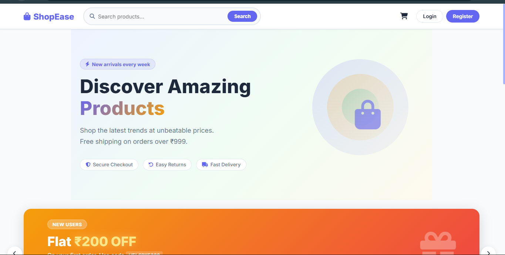
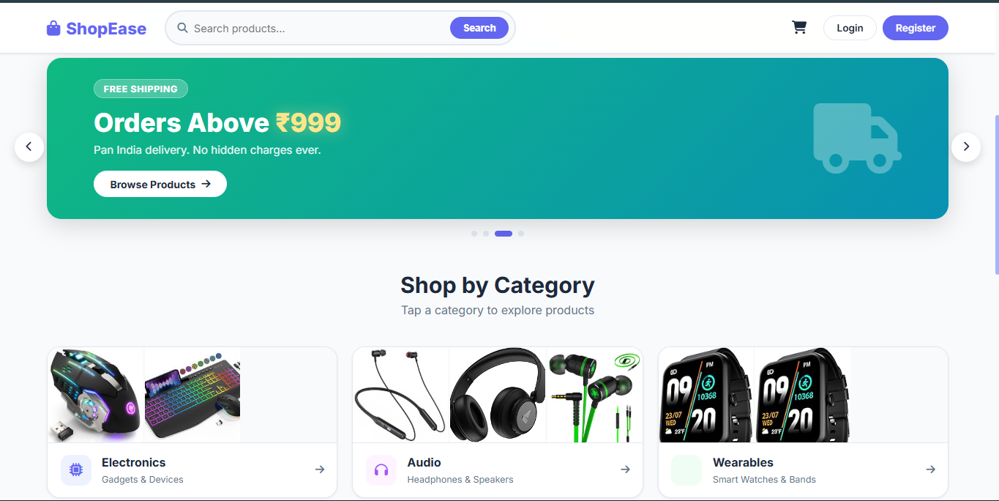
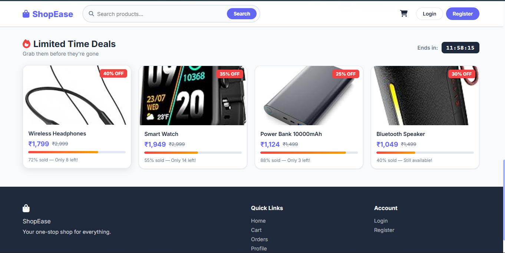

<div align="center">

# 🛍️ ShopEase — E-Commerce Web Application


A full-stack e-commerce web application built with **Spring Boot**, featuring product browsing by category, shopping cart, order placement, and user authentication.

</div>

---





| Home Page | Category Page | Product Detail |
|-----------|--------------|----------------|
|  |  |  |

| Cart | Checkout | Orders |
|------|----------|--------|
|  |  |  |

---

## ✨ Features

- 🔐 **User Authentication** — Register, Login, Logout with Spring Security & BCrypt password hashing
- 🏠 **Dynamic Homepage** — Auto-sliding offer banners with countdown timers + limited time deals section
- 📦 **Category Browsing** — Browse products by Electronics, Audio, Wearables, Accessories, Sports, Home
- 🔍 **Product Search** — Search products by name or description
- 📄 **Product Detail Page** — Full product view with description, pricing, quantity selector, and customer reviews
- 🛒 **Shopping Cart** — Add, remove, increase/decrease quantity with live AJAX updates (no page reload)
- 💳 **Checkout** — Delivery address form with COD / UPI / Card payment options
- 📋 **Order History** — View all past orders with status tracking
- 👤 **User Profile** — View and edit profile details
- 📱 **Responsive Design** — Works on desktop, tablet and mobile

---

## 🛠️ Tech Stack

| Layer | Technology |
|-------|-----------|
| Language | Java 17 |
| Framework | Spring Boot 3.2 |
| Security | Spring Security 6 + BCrypt |
| ORM | Spring Data JPA + Hibernate |
| Database | MySQL 8.0 |
| Templates | Thymeleaf 3.1 |
| Frontend | HTML5, CSS3, Vanilla JavaScript |
| Build Tool | Maven |
| Server | Embedded Tomcat |

---

## 📁 Project Structure

```
src/main/
├── java/com/ecommerce/
│   ├── EcommerceApplication.java       # Main entry point
│   ├── config/
│   │   ├── SecurityConfig.java         # Spring Security configuration
│   │   └── AuthHelper.java             # Current user helper
│   ├── controller/
│   │   ├── HomeController.java         # Home, category, product detail, search
│   │   ├── AuthController.java         # Login & Register
│   │   ├── CartController.java         # Cart CRUD with AJAX
│   │   ├── OrderController.java        # Checkout & order history
│   │   └── ProfileController.java      # View & edit profile
│   ├── model/
│   │   ├── User.java
│   │   ├── Product.java
│   │   ├── CartItem.java
│   │   ├── Order.java
│   │   └── OrderItem.java
│   ├── repository/                     # Spring Data JPA interfaces
│   └── service/                        # Business logic layer
│
└── resources/
    ├── templates/                      # Thymeleaf HTML pages
    │   ├── index.html                  # Homepage
    │   ├── category.html               # Category product listing
    │   ├── product-detail.html         # Product detail + reviews
    │   ├── cart.html                   # Shopping cart
    │   ├── checkout.html               # Checkout page
    │   ├── order-confirmation.html     # Order success page
    │   ├── orders.html                 # Order history
    │   ├── profile.html / edit-profile.html
    │   ├── login.html / register.html
    │   └── fragments/layout.html       # Shared navbar + footer
    ├── static/
    │   ├── css/style.css               # Global styles
    │   ├── css/home.css                # Homepage styles
    │   ├── css/product-detail.css      # Product detail styles
    │   ├── js/main.js                  # Global JS + toast notifications
    │   └── js/home.js                  # Slider + deals countdown
    └── application.properties          # App configuration
```

---

## ⚙️ Getting Started

### Prerequisites
- Java 17+
- Maven 3.8+
- MySQL 8.0+

### 1. Clone the repository
```bash
git clone https://github.com/YOUR_USERNAME/shopease.git
cd shopease
```

### 2. Create the database
```sql
CREATE DATABASE ecommerce_db;
```

### 3. Configure database credentials
Edit `src/main/resources/application.properties`:
```properties
spring.datasource.url=jdbc:mysql://localhost:3306/ecommerce_db
spring.datasource.username=root
spring.datasource.password=YOUR_PASSWORD
```

### 4. Import product data
```bash
mysql -u root -p ecommerce_db < clean_db.sql
```

### 5. Run the application
```bash
./mvnw spring-boot:run
```

### 6. Open in browser
```
http://localhost:8080
```

---

## 🗄️ Database Schema

```
users          → id, username, email, password, phone, address, role
products       → id, name, description, price, image, category
user_cart      → id, user_id, product_id, quantity
orders         → id, user_id, total_price, order_date, status, fullname, address, phone, payment_method
order_items    → id, order_id, product_id, quantity, price, product_name

---

## 👨‍💻 Author

**Balaji** — [GitHub](https://github.com/Balaji11704)

